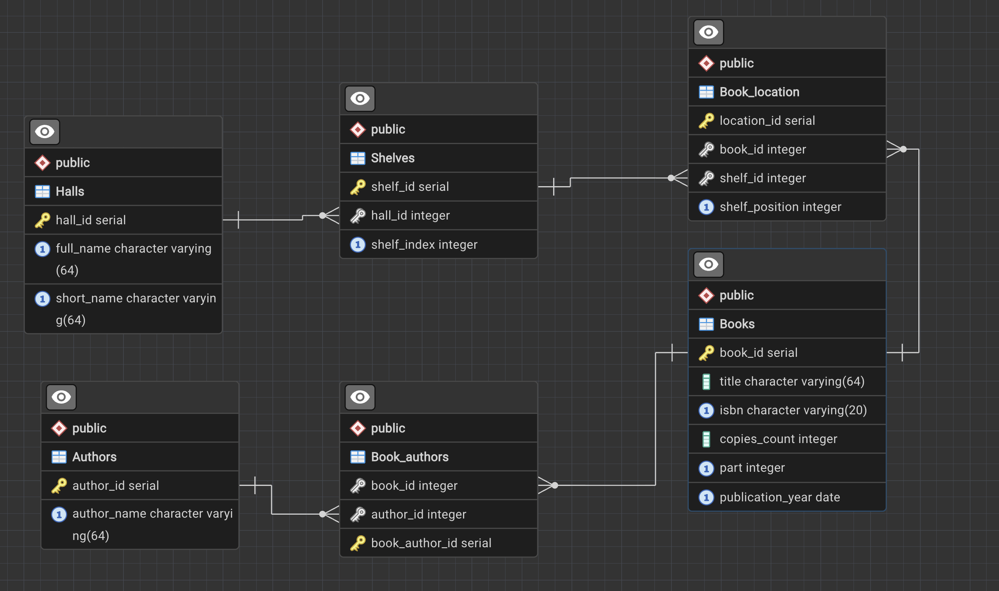

# Система управления библиотекой (SQL & Python)


## Описание проекта

Данный репозиторий демонстрирует навыки проектирования баз данных, написания сложных аналитических запросов и интеграции СУБД с прикладным кодом на примере Системы управления библиотекой. Проект охватывает полный цикл работы с данными: от нормализации схемы и очистки данных до создания хранимых процедур, триггеров для обеспечения целостности и оконных функций для аналитики.

## Использованные техники

1. **Продвинутый SQL и аналитика:**
   - CTE (Common Table Expressions): Использование обобщенных табличных выражений для поэтапной обработки данных.
   - Рекурсивные запросы (WITH RECURSIVE): Обход иерархических структур.
   - Оконные функции (Window Functions): Выполнение аналитических расчетов без сворачивания строк.
   - Сложные агрегации и подзапросы.

2. **Программирование внутри СУБД (PL/pgSQL):**
   - Хранимые процедуры и функции: Инкапсуляция бизнес-логики на стороне сервера БД.
   - Триггеры (Triggers): Автоматическая валидация данных при вставке/обновлении.
   - Представления (Views): Упрощение доступа к сложным данным.
   - Пользовательские агрегатные функции.

3. **Интеграция с Python:**
   - Работа с psycopg2 для безопасного взаимодействия с PostgreSQL.
   - Параметризированные запросы для защиты от SQL-инъекций.
   - Объектно-ориентированный подход к работе с таблицами БД.
   - Валидация пользовательского ввода и обработка исключений.

## Схема базы данных




## Структура таблиц

### Halls (Залы)
| Поле | Тип данных | Описание |
|------|------------|----------|
| hall_id | serial | Первичный ключ, идентификатор зала |
| full_name | varchar(64) | Полное название зала |
| short_name | varchar(64) | Краткое название зала |

### Shelves (Стеллажи)
| Поле | Тип данных | Описание |
|------|------------|----------|
| shelf_id | serial | Первичный ключ, идентификатор стеллажа |
| hall_id | integer | Внешний ключ, ссылка на зал |
| shelf_index | integer | Индекс стеллажа в зале |

### Books (Книги)
| Поле | Тип данных | Описание |
|------|------------|----------|
| book_id | serial | Первичный ключ, идентификатор книги |
| title | varchar(64) | Название книги |
| isbn | varchar(20) | ISBN книги |
| copies_count | integer | Количество экземпляров |
| part | integer | Номер тома или части |
| publication_year | integer | Год издания |

### Authors (Авторы)
| Поле | Тип данных | Описание |
|------|------------|----------|
| author_id | serial | Первичный ключ, идентификатор автора |
| author_name | varchar(64) | ФИО автора |

### Book_authors (Связь книг и авторов)
| Поле | Тип данных | Описание |
|------|------------|----------|
| book_author_id | serial | Первичный ключ |
| book_id | integer | Внешний ключ, ссылка на книгу |
| author_id | integer | Внешний ключ, ссылка на автора |

### Book_location (Размещение книг)
| Поле | Тип данных | Описание |
|------|------------|----------|
| location_id | serial | Первичный ключ |
| book_id | integer | Внешний ключ, ссылка на книгу |
| shelf_id | integer | Внешний ключ, ссылка на стеллаж |
| shelf_position | integer | Позиция книги на стеллаже |

## Ключевые реализации

### 1. Аналитика загруженности складских помещений (CTE)
**Задача:** Найти названия всех книг, которые стоят на самом загруженном стеллаже библиотеки.
**Решение:** Использование CTE для поэтапного подсчета количества книг на каждом стеллаже и поиска максимума.
**Файл:** `lab_1.sql`

### 2. Очистка данных от дубликатов (Data Cleaning)
**Задача:** Удалить из базы все книги-дубликаты по ISBN, оставив только самое свежее издание.
**Решение:** Каскадное удаление записей из зависимых таблиц перед удалением самих книг.
**Файл:** `lab_2.sql`

### 3. Расчет сложных бизнес-метрик (PL/pgSQL Функции)
**Задача:** Рассчитать «продуктивность» автора с учетом соавторства.
**Решение:** Написание пользовательской функции get_author_p(author_name).
**Файл:** `lab_3.sql`

### 4. Продвинутая аналитика без группировки (Оконные функции)
**Задача:** Для каждой книги вывести её название, имя автора, общее количество книг этого автора и общее количество соавторов у данной книги.
**Решение:** Использование оконных функций COUNT(*) OVER(PARTITION BY ...).
**Файл:** `lab_4.sql`

### 5. Обеспечение качества данных на уровне БД (Триггеры)
**Задача:** Запретить добавление одной и той же книги на стеллажи, индексы которых отличаются более чем на 5 позиций.
**Решение:** Создание триггера trg_check_shelf_distance, срабатывающего перед вставкой.
**Файл:** `lab_5.sql`

### 6. Абстракция данных и безопасное обновление (Views + Instead Of Triggers)
**Задача:** Создать удобное представление book_full_info и разрешить обновление количества экземпляров через это представление.
**Решение:** Создание представления и триггера INSTEAD OF UPDATE.
**Файл:** `lab_6.sql`

### 7. Интеграция с Python и разработка CLI-приложения
**Задача:** Создать консольное приложение на Python для управления библиотечными залами и стеллажами с полным циклом CRUD-операций (создание, чтение, обновление, удаление).
**Решение:** Разработка объектно-ориентированного приложения с использованием библиотеки psycopg2. Реализована безопасная работа с базой данных через параметризированные запросы, валидация пользовательского ввода на уровне приложения и обработка исключений PostgreSQL (нарушение уникальности, внешние ключи). Также реализована пагинация данных для удобного просмотра больших списков.
**Файл:** `lab_7/main.py`

## Инструкция по запуску

1. Установите PostgreSQL и создайте новую базу данных.

2. Для создания структуры таблиц выполните файл `create_tables.sql`. Этот файл содержит DDL-скрипты для создания всех необходимых таблиц, ограничений и внешних ключей.

3. После создания структуры таблиц вы можете дополнить базу данными, выполнив INSERT-запросы из `inserts.sql` т или добавив свои тестовые данные.

4. Установите зависимости для Python:
   ```bash
   pip install psycopg2-binary
   ```

5. Настройте подключение в файле `lab_7/project_config.py`, указав свои параметры подключения к базе данных (хост, порт, имя БД, пользователь, пароль).

6. Запустите Python-приложение:
   ```bash
   cd lab_2_7
   python main.py
   ```

7. Через интерфейс приложения вы сможете управлять залами и стеллажами, добавлять, редактировать и удалять записи с проверкой целостности данных.